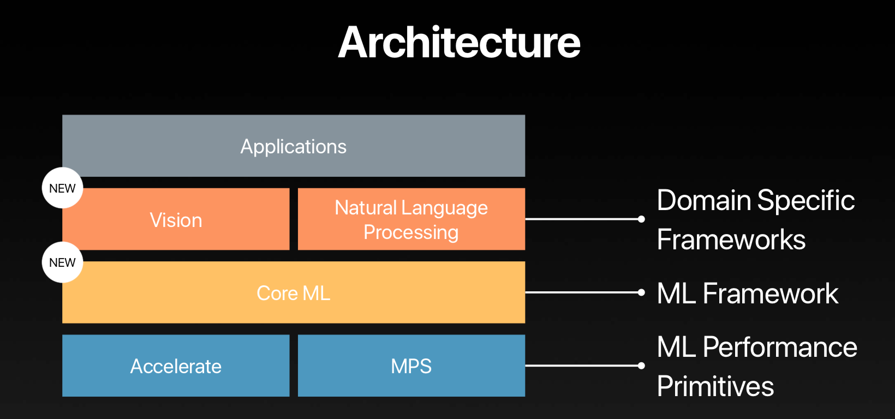
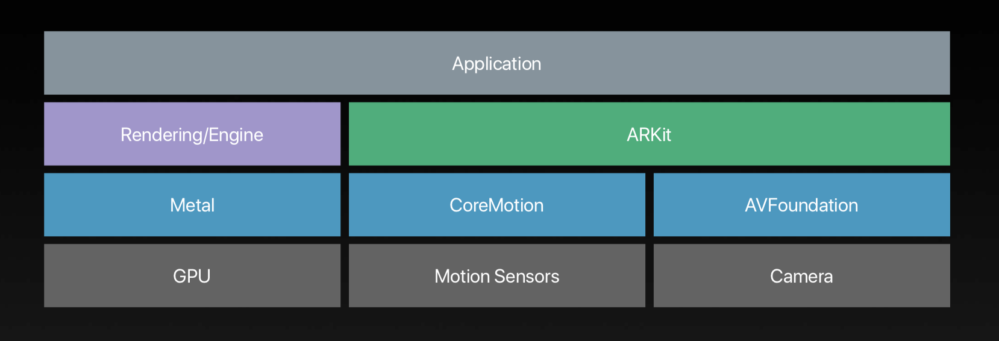

# Studying WWDC 2017 - 102 Platform State of the Union

| Date | Notes | Swift | Xcode |
|:-----:|:-----:|:-----:|:-----:|
| 2017-07-02 | 首次提交 | 4.0 beta | 9.0 beta|

> WWDC 2017 是苹果开发者大会的 2017 版，今年的更新很多，而且涉及多种平台，开发工具，以及 Swift 语言本身。102 这场演讲涉及了新系统以及新工具中的 features，但没有过多深入。因为后续还有更加独立的 Session 可供我们学习，查看，所以本文仅涉及本人认为需要的内容。关于 Metal 2 和 VR 距离我个人能力所及较远，本文也没有提及。

## macOS

- macOS High Sierra 将是最后一个支持 32 位程序的 macOS 版本。
- App Store 64 位 App: 2018.01 新 App 务必支持；2018.07 所有 App 务必支持。

## Playground 2.0

- 将集成 API 文档，且支持 AR。

## Xcode 9

- 支持 Swift，Objective-C，C/C++ 重构。
- 构建速度加快，打包后体积更小。

## String

- String 在 Swift 4.0 中已改为集合类型（Collection）。

```Swift
// String 是 Character 的集合
var s = "Hello!"
for c in s {
    print(c)
}

s.last == "!"
s.index(of: "!")

s.dropLast() + " world!"

// 多行字符串字面量
let html = """
<!DOCTYPE html>
<html lang="zh-CN">
    <head>
        <title>Demo</title>
    </head>
    <body>
        <h1>Test multi-line string literals.</h1>
    </body>
</html>
"""

let gtIndex = html.index(of: ">")!
let substring = html[...gtIndex]

// Unicode 9 Grapheme Breaking
"👩‍👩‍👧‍👦".count == 1
```

## Codable

```Swift
// Codable 是 Decodable & Encodable 的别名
// A type that can convert itself into and out of an external representation.
// public typealias Codable = Decodable & Encodable

struct Location: Codable {
    var latitude: Double
    var longitude: Double
}

enum Animal: Int, Codable {
    case cow = 0
    case dog = 1
    case chicken = 2
}

struct Farm: Codable {
    let name: String
    let location: Location
    let animals: [Animal]
}

let farm = Farm(name: "Kingcos' Farm",
                location: Location(latitude: 1.0,
                                   longitude: 1.0),
                animals: [.cow, .dog, .chicken])

// -> JSON
let payload: Data = try JSONEncoder().encode(farm)
print(String(data: payload, encoding: .utf8) ?? "nil")

// JSON ->
let farmFromJSON = try JSONDecoder().decode(Farm.self, from: payload)
farmFromJSON.location.latitude
```

## Swift 3.2 vs Swift 4.0

- Swift 3.2 兼容旧项目，不需要修改即可构建。
- Swift 3.2 不包含 Swift 4.0 中对现有 API 的改进。

## Drag & Drop

- 此处代码摘自视频，未经测试。

```Swift
// Begin Drag
let dragData = self.data(at: sourceIndexPath)
let itemProvider = NSItemProvider(object: dragData)
return [UIDragItem(itemProvider: itemProvider)]

// Perform Drop
coordinator.session.loadObjects(ofClass: MyDataType.self) { (data) in
    self.insertData(data, at: destinationIndexPath)
    collectionView.reeloadSections(IndexSet(integer: 0)) 
    }
```

## Large Titles

- 此处代码摘自视频，未经测试。

```Swift
// Adopt Large Titles
navigationBar.prefesLargeTitles = true

// Automatically Choose Large Title
navigationItem.largeTitleDisplayMode = .automatic

// Adopt Unified Search Bar
navigationItem.searchController = searchController
```

## HEVC & HEIF

- 新的视频和图片压缩编码标准。
- 此处代码摘自视频，未经测试。

```Swift
// 在不支持新标准的平台播放可加入以下判断
var asset = AVAsset(url: URL(fileURLWithPath: "hevc.mov"))
if !asset.isPlayable {
    asset = AVAsset(url: URL(fileURLWithPath: "h264.mov"))
}


let url = URL(string: "")!
CIImage(contentsOf: url, options: [kCIImageAuxiliaryDepth: true])
```

## Machine Learning



## ARKit



## Reference

- [WWDC 17 - 102 Platforms State of the Union](https://developer.apple.com/videos/play/wwdc2017/102/)