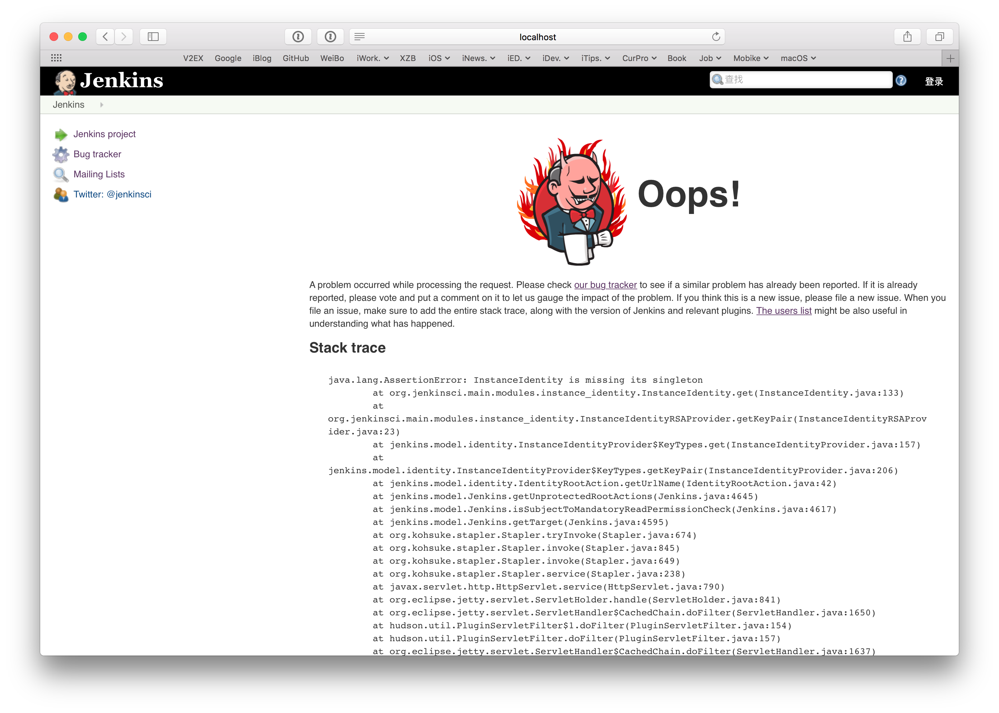

# Tips - 使用 Homebrew 安装 Jenkins

| Platform | Notes |
|:-----:|:-----:|
| macOS 10.13.4 | Jenkins 2.114 & Java 8 |

## Solution

- 安装 Homebrew

```shell
/usr/bin/ruby -e "$(curl -fsSL https://raw.githubusercontent.com/Homebrew/install/master/install)"
```

- 安装 Jenkins

```shell
brew install jenkins
```

> Tips
> 
> 若出现下图问题，可能是 Jenkins 尚未很好支持 Java 9，请安装 Java 8 以兼容：
> 
> 

- 运行 Jenkins

```shell
# 当前窗口启动（关闭窗口则关闭 Jenkins）
# $JENKINS_VERSION_CODE 为版本号，$PORT 为 Jenkins Web 页面端口号
# java -jar /usr/local/Cellar/jenkins/$JENKINS_VERSION_CODE/libexec/jenkins.war --httpPort=$PORT

# 后台启动（关闭窗口无影响）
# $OUTPUT_FILENAME 为终端输出内容存放的文件名
# nohup java -jar /usr/local/Cellar/jenkins/$JENKINS_VERSION_CODE/libexec/jenkins.war >$OUTPUT_FILENAME &
nohup java -jar /usr/local/Cellar/jenkins/2.114/libexec/jenkins.war >temp.txt &
```

## Extension

- [macOS 下管理多个 Java 版本](../Java_Multiple_Versions)

> 也欢迎您关注我的微博 [@萌面大道V](http://weibo.com/375975847)
